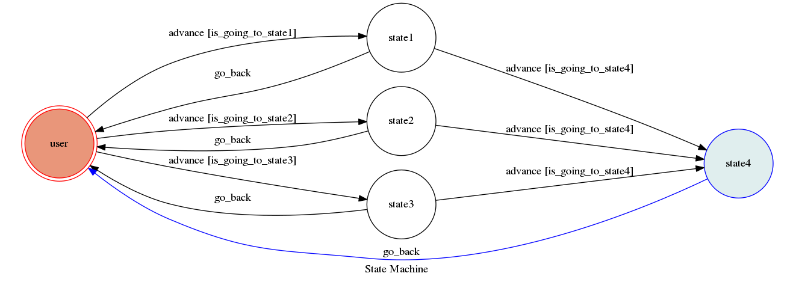

# Opman_bot

# TOC Project 2019

### Prerequisite
* Python 3
* Facebook Page and App
* HTTPS Server

## Finite State Machine

## Usage
The initial state is set to user.

Every time user state is triggered to advance to another state, and if it is triggered to advance to state4 again, it will go_back to user state after the bot replies corresponding message.

* user
	* Input: "go to state1"
		* Reply: "I'm entering state1"

	* Input: "go to state2"
		* Reply: "I'm entering state2"

    * Input: "go to state3"
        * Reply: "I'm entering state3"

* State1,2,3
    * Input: "go to state4"
        * Reply: "I'm entering state4"
